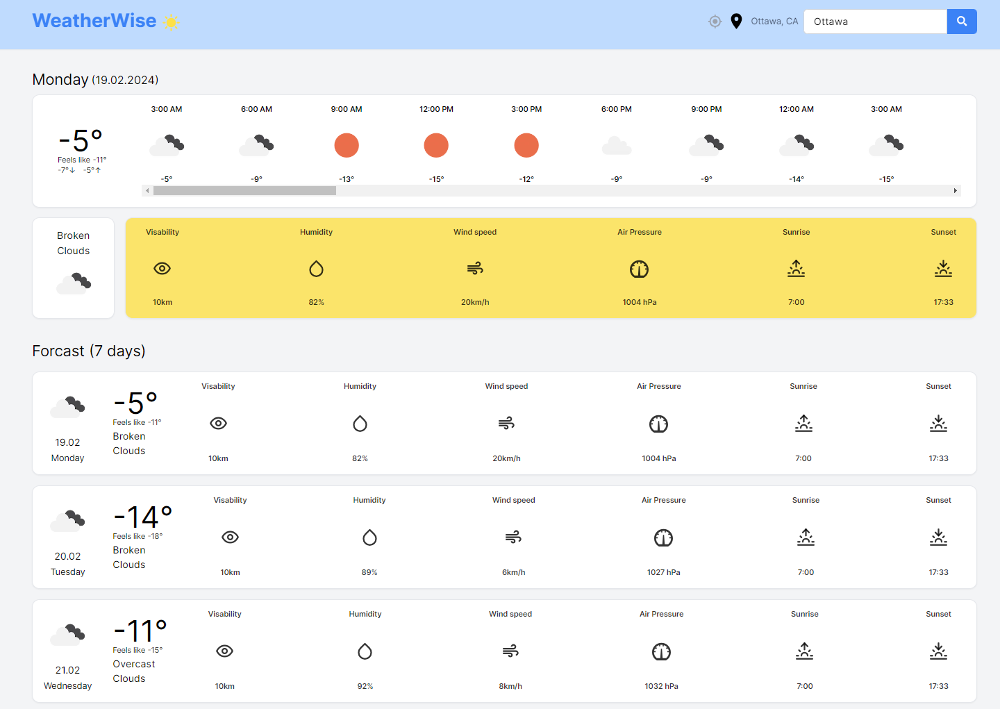

## Weather App
created using `Next.js`, `TypeScript`, `Tailwind`, `WeatherAPI`. <br>

### Features
- Search for weather forecasts by city.
- Use your current location to find weather forecasts.
- View current day weather forecasts.
- Access 7-day weather forecasts.

####  Weather App Main Screen


#### Weather App Loading Screen


### Getting Started

To get a local copy up and running, follow these simple steps:

##### Clone the repo
   ```bash
   git clone https://github.com/mr-Arturio/Wheather_App.git
   ```
- npm install      
- npm install react-icons --save
- npm i tailwind-merge clsx
- npm i @tanstack/react-query
- npm i axios
- npm i date-fns
- npm i jotai

```bash
npm run dev
```
Open [http://localhost:3000](http://localhost:3000) with your browser to see the result.

### Dependencies
- `@tanstack/react-query`: "^5.18.1",
- `axios`: "^1.6.7",
- `clsx`: "^2.1.0",
- `date-fns`: "^3.3.1",
- `jotai`: "^2.6.4",
- `next`: "14.1.0",
- `react`: "^18",
- `react-dom`: "^18",
- `react-icons`: "^5.0.1",
- `tailwind-merge`: `^2.2.1"

### Resources
- [OpenWeatherMap](https://openweathermap.org/): Provides the weather data used in the app through their API.
  - ```https://api.openweathermap.org/data/2.5/forecast?q=$ottawa&appid=${process.env.NEXT_PUBLIC_WEATHER_KEY}&cnt=56```
- [React Icons](https://react-icons.github.io/react-icons/): Supplies icons for the user interface, enhancing visual appeal and user experience.
- [Jotai](https://jotai.org/): A minimalistic state management solution for React that helps manage the app's state with simplicity and efficiency.

This project uses [`next/font`](https://nextjs.org/docs/basic-features/font-optimization) to automatically optimize and load Inter, a custom Google Font.

## Learn More

To learn more about Next.js, take a look at the following resources:

- [Next.js Documentation](https://nextjs.org/docs) - learn about Next.js features and API.
- [Learn Next.js](https://nextjs.org/learn) - an interactive Next.js tutorial.

You can check out [the Next.js GitHub repository](https://github.com/vercel/next.js/) - your feedback and contributions are welcome!

## Deploy on Vercel

The easiest way to deploy your Next.js app is to use the [Vercel Platform](https://vercel.com/new?utm_medium=default-template&filter=next.js&utm_source=create-next-app&utm_campaign=create-next-app-readme) from the creators of Next.js.

Check out our [Next.js deployment documentation](https://nextjs.org/docs/deployment) for more details.
